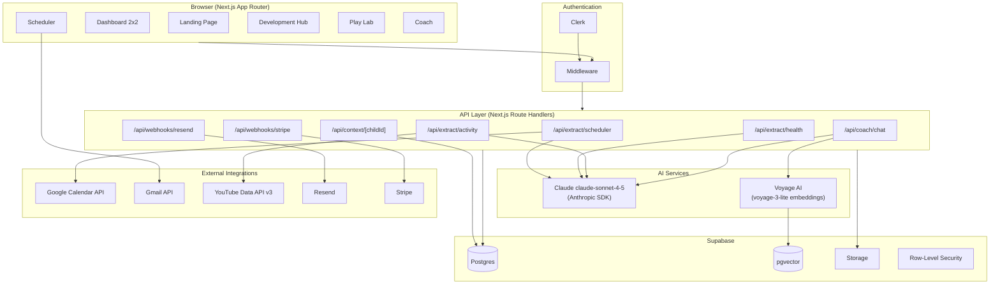
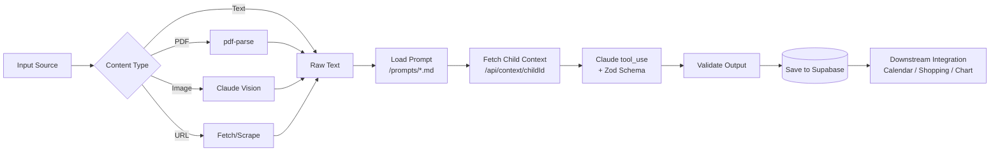
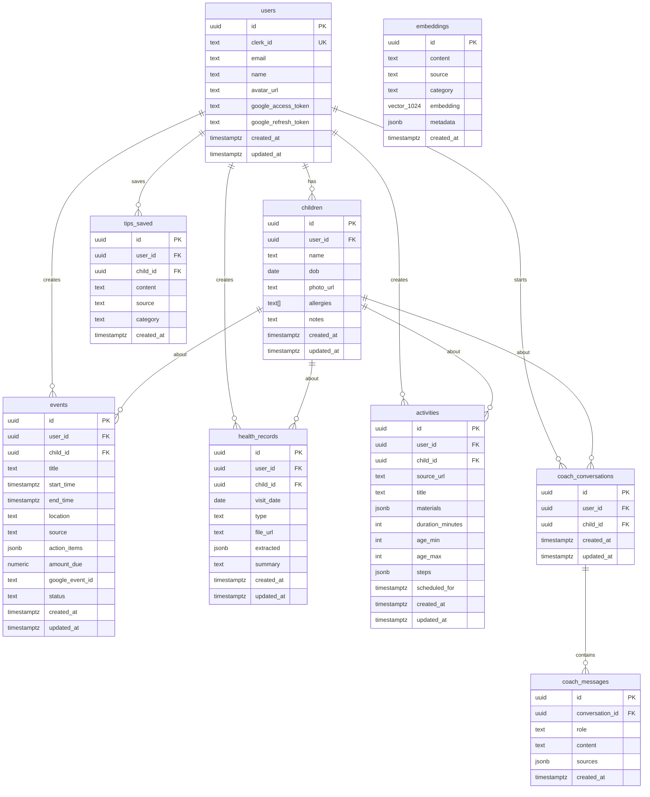
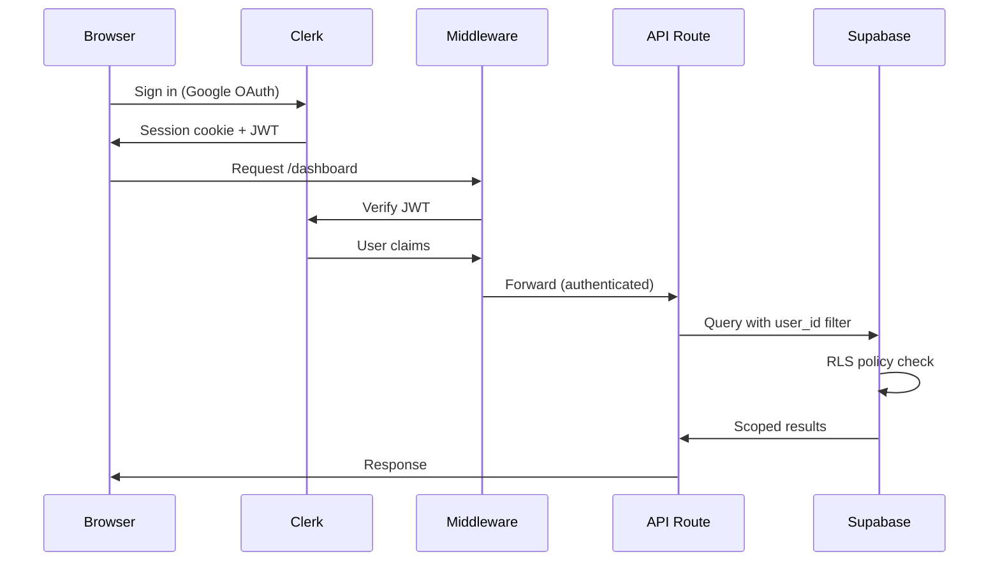

# Architecture

## System Overview



## Extraction Pipeline

Every quadrant follows the same extraction pattern:



## Data Model

### Entity Relationship Diagram



### Table Details

| Table | Purpose | Key Columns |
|---|---|---|
| `users` | Mirror of Clerk user, stores Google OAuth tokens | `clerk_id`, `google_refresh_token` |
| `children` | Child profiles — the central entity | `name`, `dob`, `allergies[]`, `notes` |
| `events` | Extracted events from Scheduler | `title`, `start_time`, `action_items` (jsonb), `status` |
| `health_records` | Extracted health data from Development Hub | `visit_date`, `type`, `extracted` (jsonb), `file_url` |
| `activities` | Extracted activity plans from Play Lab | `source_url`, `materials` (jsonb), `steps` (jsonb) |
| `tips_saved` | Bookmarked tips from Coach | `content`, `source`, `category` |
| `coach_conversations` | Conversation threads | `child_id` |
| `coach_messages` | Individual messages in conversations | `role`, `content`, `sources` (jsonb) |
| `embeddings` | pgvector embeddings for RAG | `content`, `embedding` (vector 1024), `source` |

## Auth Flow



Clerk handles authentication. The Next.js middleware (`src/middleware.ts`) protects all `(dashboard)` routes. Supabase RLS policies enforce that users can only access their own data — every query must include a `user_id` filter.

## Cross-Quadrant Context Service

The `/api/context/[childId]` endpoint is the intelligence layer that connects all four quadrants. It aggregates:

```
GET /api/context/{childId}
→ {
    child: { name, dob, allergies, notes },
    upcoming_events: [...last 30 days from events table],
    recent_health: [...last 3 from health_records],
    recent_activities: [...last 5 from activities],
    recent_topics: [...last 3 coach conversation topics]
  }
```

This context is injected into every Claude system prompt, enabling personalized responses across all quadrants.

## External API Integrations

| Service | Purpose | Auth Method | Rate Limits | Fallback |
|---|---|---|---|---|
| **Anthropic** (Claude) | All AI extraction and chat | API key (`ANTHROPIC_API_KEY`) | 4,000 RPM (Tier 1) | Queue and retry with exponential backoff |
| **Voyage AI** | Embedding generation for RAG | API key (`VOYAGE_API_KEY`) | 300 RPM (free tier) | Cache embeddings; batch requests |
| **Google Calendar** | Write extracted events | OAuth 2.0 (user consent) | 1,000,000 queries/day | Store events locally; sync on next login |
| **Gmail** | Read school emails (V2) | OAuth 2.0 (user consent) | 250 quota units/user/sec | Email forwarding via Resend (V1) |
| **YouTube Data API** | Video metadata + transcripts | API key (`YOUTUBE_API_KEY`) | 10,000 units/day | Use youtube-transcript npm package for captions |
| **Resend** | Inbound email parsing + notifications | API key (`RESEND_API_KEY`) | 100 emails/day (free) | Manual paste/upload in Scheduler UI |
| **Stripe** | Subscription management | API key (`STRIPE_SECRET_KEY`) | No hard limit | Scaffold only for V1 |
| **Supabase Storage** | File uploads (PDFs, images) | Service role key | 50MB per file | Compress before upload |
