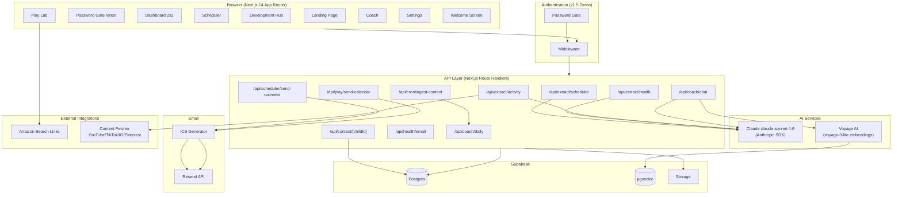
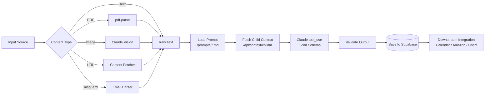
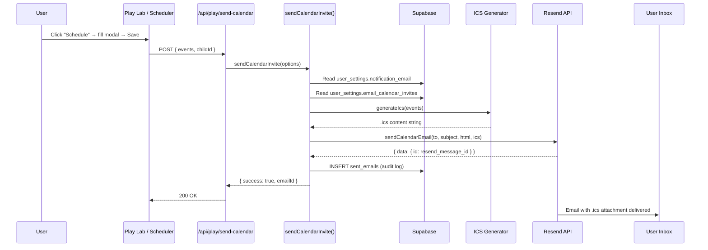
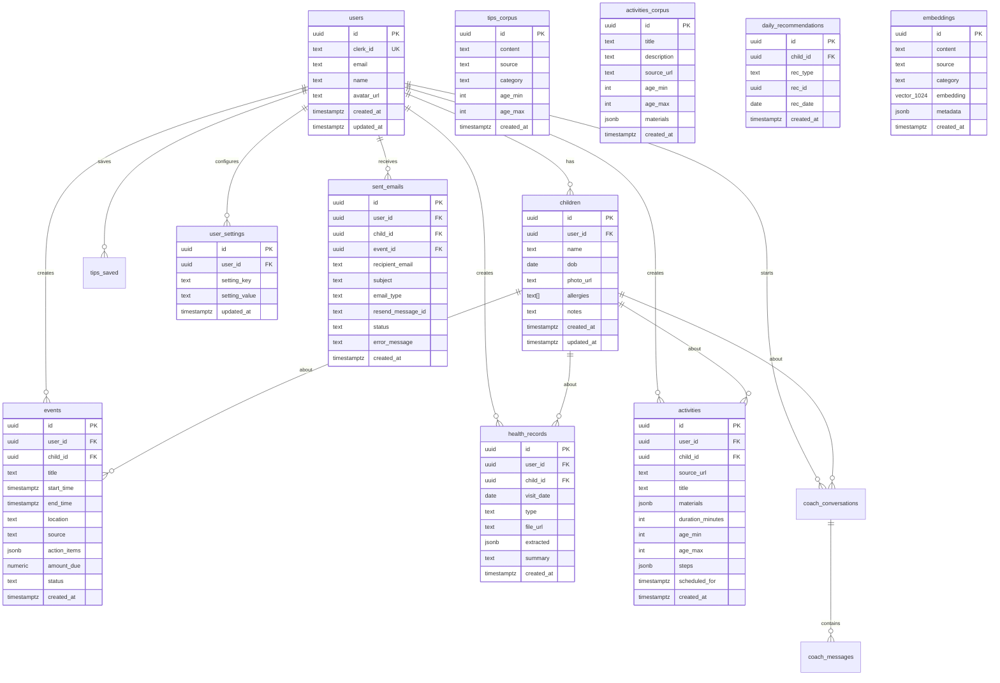
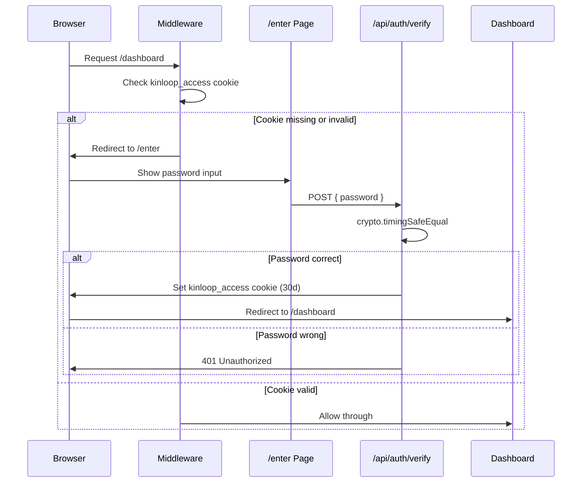

# Architecture

## System Overview



## Extraction Pipeline

Every quadrant follows the same extraction pattern:



## Calendar Invite Pipeline (v1.5)



## File Structure

```
kinloop/
├── src/
│   ├── app/
│   │   ├── (dashboard)/           # Protected routes (password gate)
│   │   │   ├── dashboard/         # 2x2 grid home
│   │   │   ├── scheduler/         # Q1: Email/PDF extraction → events
│   │   │   ├── development/       # Q2: Health records, growth chart
│   │   │   ├── play/              # Q3: URL extraction → activities
│   │   │   ├── coach/             # Q4: RAG chat, daily tips
│   │   │   ├── settings/          # Notification email, photo upload
│   │   │   └── layout.tsx         # Dashboard shell (sidebar + topbar)
│   │   ├── api/
│   │   │   ├── extract/           # Claude extraction endpoints (3)
│   │   │   ├── coach/             # Chat, daily, save-tip
│   │   │   ├── context/           # Cross-quadrant context service
│   │   │   ├── play/              # Play Lab calendar invite
│   │   │   ├── scheduler/         # Scheduler calendar invite
│   │   │   ├── health/            # Health check + email diagnostics
│   │   │   ├── health-records/    # CRUD for health records
│   │   │   ├── measurements/      # Growth measurement data
│   │   │   ├── milestones/        # Developmental milestones
│   │   │   ├── events/            # CRUD for events
│   │   │   ├── activities/        # CRUD for activities
│   │   │   ├── children/          # Child profiles + photo upload
│   │   │   ├── settings/          # User settings CRUD
│   │   │   ├── auth/              # Password verification
│   │   │   ├── cron/              # Daily content ingestion
│   │   │   ├── parse/             # Email parsing
│   │   │   └── webhooks/          # Resend + Stripe (placeholder)
│   │   ├── enter/                 # Password gate page
│   │   ├── page.tsx               # Landing page
│   │   ├── layout.tsx             # Root layout (Inter font, AuthProvider)
│   │   └── globals.css            # Design tokens, animations
│   ├── components/
│   │   ├── dashboard/             # Sidebar, TopBar, Grid, QuadrantTile
│   │   ├── ui/                    # Button, Skeleton, EmptyState, QuadrantCard
│   │   ├── icons/                 # QuadrantIcons
│   │   ├── WelcomeScreen.tsx      # 7s cinematic welcome with photo
│   │   ├── WelcomePhotoUploader.tsx
│   │   └── providers/             # AuthProvider (passthrough for demo)
│   ├── lib/
│   │   ├── anthropic.ts           # Claude client + CLAUDE_MODEL constant
│   │   ├── extractors/            # Zod schemas + extraction logic (3)
│   │   ├── integrations/          # Amazon, Resend, YouTube, Gmail, GCal, Content Fetcher
│   │   ├── calendar/              # ICS generator + shared send-invite utility
│   │   ├── rag/                   # Embed, search, seed-corpus
│   │   ├── supabase/              # Admin, client, server, types
│   │   ├── parsers/               # Email parser (.msg/.eml)
│   │   ├── hooks/                 # use-children
│   │   ├── prompts.ts             # Prompt loader utility
│   │   ├── utils.ts               # Shared utilities
│   │   └── who-growth-data.ts     # WHO growth percentile data
│   └── middleware.ts              # Password gate middleware
├── prompts/                       # Claude prompt templates (4 .md files)
├── supabase/
│   ├── migrations/                # SQL migrations (4 files, 14 tables)
│   └── seed.sql                   # Demo data (Jenn + Mia)
├── tests/unit/                    # Vitest tests (18 total)
├── docs/                          # API docs, prompt changelog, audit, demo script
├── vercel.json                    # Cron configuration
├── tailwind.config.ts             # Design tokens + quadrant colors
└── next.config.js                 # Image domains, server action limits
```

## Data Model

### Entity Relationship Diagram



### Table Summary

| Table | Migration | Purpose |
|---|---|---|
| `users` | 0001 | User profiles (demo: Jenn) |
| `children` | 0001 | Child profiles (demo: Mia, DOB 2022-02-15) |
| `events` | 0001 | Extracted events + cross-quadrant scheduled activities |
| `health_records` | 0001 | Extracted health data from Development Hub |
| `activities` | 0001 | Extracted activity plans from Play Lab |
| `tips_saved` | 0001 | Bookmarked tips from Coach |
| `coach_conversations` | 0001 | Conversation threads |
| `coach_messages` | 0001 | Individual messages in conversations |
| `embeddings` | 0001 | pgvector embeddings for RAG (1024-dim Voyage AI) |
| `user_settings` | 0003 | Key-value settings (notification_email, email_calendar_invites) |
| `sent_emails` | 0003 | Outbound email audit log with Resend message IDs |
| `tips_corpus` | 0004 | Parenting tips for Coach daily picks |
| `activities_corpus` | 0004 | Age-filtered activities for Coach daily picks |
| `daily_recommendations` | 0004 | Cached daily tip/activity of the day |

## Auth Flow (v1.5 Demo)



The shared-password gate is intentional for the HBS demo. Clerk is installed but not active — upgrading to real multi-user auth is a Series A milestone. The database schema already has `user_id` columns on every table to support future multi-tenancy.

**Note on RLS:** RLS policies exist in Supabase but the demo currently uses the admin client (`getAdminClient()` with service role key) which bypasses RLS. This is because there is no authenticated user session in the shared-password demo mode. When Clerk is integrated (Series A), the server client (`createServerSupabaseClient()`) will be used instead, and RLS will be enforced per-user.

## Cross-Quadrant Context Service

The `/api/context/[childId]` endpoint is the intelligence layer that connects all four quadrants. It aggregates:

```
GET /api/context/{childId}
→ {
    child: { name, dob, allergies, notes },
    upcoming_events: [...last 30 days from events table],
    recent_health: [...last 3 from health_records],
    recent_activities: [...last 5 from activities],
    recent_topics: [...last 3 coach conversation topics]
  }
```

This context is injected into every Claude system prompt, enabling personalized responses across all quadrants.

## External API Integrations

| Service | Purpose | Auth Method | Status (v1.5) |
|---|---|---|---|
| **Anthropic** (Claude) | All AI extraction and chat | API key (`ANTHROPIC_API_KEY`) | Active |
| **Voyage AI** | Embedding generation for RAG | API key (`VOYAGE_API_KEY`) | Active |
| **Resend** | Calendar invite emails with .ics | API key (`RESEND_API_KEY`) | Active (sandbox domain) |
| **Amazon** | Material shopping links | None (search-link fallback) | Active (V1 search links) |
| **YouTube** | Video transcript extraction | Public (no key for transcripts) | Active |
| **Google Calendar** | Write extracted events | OAuth 2.0 | Planned (Series A) |
| **Gmail** | Read school emails | OAuth 2.0 | Planned (Series A) |
| **Stripe** | Subscription management | API key | Planned (Series A) |
| **Supabase Storage** | File uploads (PDFs, images, photos) | Service role key | Active |

## Design System

The design follows a warm Scandinavian minimalist aesthetic with quadrant-specific accent colors defined as CSS custom properties in `globals.css`:

| Token | HSL Value | Usage |
|---|---|---|
| `--background` | `40 20% 96%` | Page background (warm off-white) |
| `--scheduler` | `262 47% 55%` | Scheduler accent (purple) |
| `--development` | `168 40% 45%` | Development Hub accent (teal) |
| `--play` | `15 70% 60%` | Play Lab accent (coral) |
| `--coach` | `340 45% 60%` | Coach accent (rose) |

Typography: Inter (400/500/600/700) via `next/font/google`. Letter-spacing tightened on headings (`-0.01em`) and body text (`-0.005em`).

## Deployment

- **Platform**: Vercel
- **Production URL**: `kinloop-weld.vercel.app`
- **PR previews**: `kinloop-git-{branch}-dada5531s-projects.vercel.app`
- **Cron**: Daily content ingestion at 6:00 AM UTC (`/api/cron/ingest-content`)
- **Build**: `next build` (no custom build step)
- **Node**: 20.x
